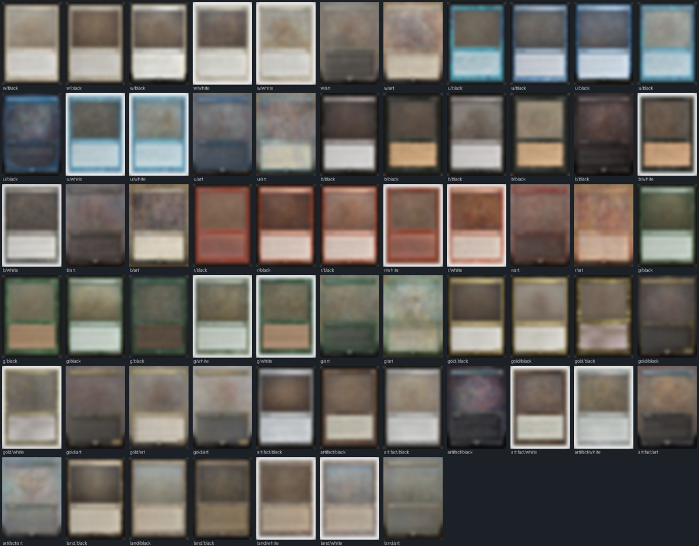
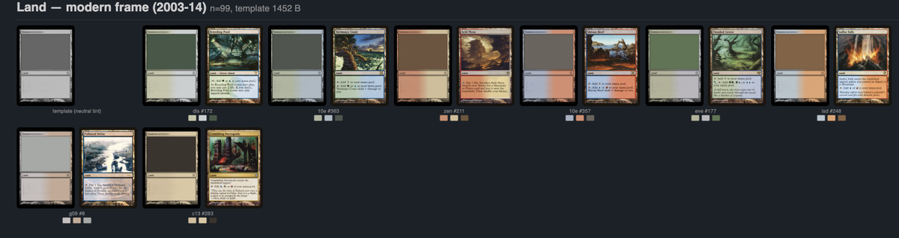

A card image on a long-tail CloudFront miss takes 150–220ms to arrive, and there is not much left to optimize on that path — we measured a cold miss at 192ms TTFB from Boston with `Cache-Control: immutable` already set, the preconnect already in place, and independent benchmarks showing no origin (Wasabi, R2) beats S3's time-to-first-byte from where our users are. So the remaining move is to mask the wait with a placeholder. This post is about how we built placeholder generation with k-means clustering, watched it work, and then deleted it — because the clusters it learned turned out to be a lossy reconstruction of columns we already had in PostgreSQL. The final design ([PR #608](https://github.com/jbylund/sylvan_librarian/pull/608)) is a pure metadata lookup plus nine measured bytes per card, and it produces *better* placeholders than the clustering did.

## The Insight That Was Right

The standard per-card placeholder is a blurhash or thumbhash: 25–30 bytes per card in every API response, plus client-side decode. But Magic card images are unusually low-entropy: the frame — border, title bar, text box — dominates the pixels, and frames are nearly identical within a frame generation and color. A blurry placeholder of "a modern-frame red card" is a good placeholder for *every* modern-frame red card. So instead of per-card data, build a shared dictionary: cluster all card images, blur the cluster centroids, ship them once as CSS classes, and stamp each card with a cluster id.

We ran it: 8,242 artwork-unique 280px thumbnails sampled from the live API, downscaled to 28×39 RGB, k-means per stratum (the five mono colors, gold, artifact, land — crossed with a border class read from the outer pixel ring, since border color is perceptually loud but only a sliver of the pixel distance). An elbow rule picked k per stratum. Result: 62 centroids totalling 11.4KB as webp data URIs.



It worked on the first try, and the contact sheet is genuinely pleasing: the clusters separated old frames from modern frames from M15 frames on their own, split white borders from black, and discovered full-art layouts unprompted. We shipped it as [PR #607](https://github.com/jbylund/sylvan_librarian/pull/607) — codebook artifact, nearest-centroid assignment in the image pipeline, one `image_cluster_id` column flowing PostgreSQL → Rust engine → API → both renderers.

## Three Tells

Then we looked harder at the output, and three things were off.

**The clusters were the metadata.** Every boundary k-means discovered — frame generation, color, border, full-art — is a field Scryfall already publishes per printing: `frame`, `colors`, `border_color`, `full_art`. The clustering was an expensive, approximate reconstruction of columns sitting in our `raw_card_blob`. The one thing we hoped it would find *beyond* the metadata — recognizable art archetypes, a vague fire-and-lightning smear for red burn spells — never materialized: art boxes average to mud, because art composition varies too much for a mean to survive blurring.

**The pixel gate misfiled cards the metadata gets right.** A full-art card with dark edge pixels reads as "black border" to a ring-luminance check and lands in the ordinary red cluster. Scryfall's `border_color: borderless` knows better. When your learned classifier loses to a dictionary lookup, that is not a tuning problem.

**Quantization sits exactly where the eye notices.** Within "old-frame black-border red" there is real shade variance — a Collectors' Edition red is printed and scanned visibly brighter than a Urza's-block red — and 62 fixed looks cannot represent it. Some cards will always sit far from their centroid, and frame shade is the thing a placeholder most needs to match.

## Split the Information by Where It's Cheap

The fix is to notice the codebook was conflating two kinds of information with different economics. **Structure** — the card-shaped arrangement of border, art window, and text box — is nearly universal: a handful of shapes, one per frame generation. **Color** — this printing's exact frame shade and art tone — is per-card, and per-card is exactly where it's cheap, because it's just bytes.

So: ~40 shared **grayscale templates**, one per (frame generation × color group) bucket, each just the average of its bucket's members with a transparent art window punched out. And per printing, **three measured colors** (~9 bytes): frame tint left, frame tint right, mean art color. The client composites them in CSS — border color (a categorical constant baked into the bucket class, straight from `border_color`), an inset frame-tint gradient, the art color in the window, and the grayscale template multiplied over the top:

```css
[class^="ph-"] {
  background-image:
    var(--tpl),                                   /* grayscale template, multiply */
    linear-gradient(var(--art), var(--art)),      /* art window */
    linear-gradient(90deg, var(--frame-l) 0 40%,  /* frame tint(s) */
                           var(--frame-r) 60% 100%);
  background-blend-mode: multiply, normal, normal;
}
```

The renderer emits `class="card-image ph-modern-r" style="--frame-l:#8a3b2f;--frame-r:#6a4a3f;--art:#334455"`, and the real image simply paints over the stack when it arrives.

Two details carry the quality. First, the tint is not the mean of the card's frame pixels — it's the least-squares solve of `template × tint ≈ card` over the frame region, i.e. the card *divided by* the template, so the template's own shading (text lines, shadows) doesn't drag every reconstruction dark. Second, measuring the left and right sides separately (transition band excluded) means two-color frames fall out for free: Breeding Pool's placeholder shades green into blue exactly like the card, and mono-colored cards measure the same color twice, degenerating to a flat fill with no detection logic anywhere.



## What Deleting the ML Bought

The bucket function is fifteen lines of metadata checks, and that has consequences beyond aesthetics. Cluster ids from k-means are meaningless integers whose semantics live in a training artifact — rebuild the codebook and every id shuffles, so we had designed append-only id registries, centroid matching across rebuilds, and tombstoned CSS classes just to survive retraining. Bucket names like `modern-r` mean the same thing forever; rebuilding templates refreshes images without ever changing meaning, and the entire id-lifecycle design evaporated unwritten.

One trap worth naming for anyone bucketing by frame: use Scryfall's `frame` field, never release year. Year fails in both directions — the M15 frame shipped mid-2014, and retro-frame reprints (The List, Dominaria Remastered) are new releases printed with 1997 frames. Our first mockup used year buckets and roughly half of the "M15 green" bucket turned out to be contamination.

The costs, honestly: the stylesheet grew from 17KB of centroids to 64KB of templates (async, content-hashed, cached forever — and the template resolution is a knob we chose generously); the per-card payload grew from a 4-byte int to a ~30-byte string; `background-blend-mode` across four layers is the one genuinely clever CSS in the system and still owes us a Safari/Firefox pass. A single frame tint slightly washes out modern frames whose text box is much paler than their title bar — we judged that acceptable by eye rather than spending a fourth color on it. And placeholders are per printing, not per face, because our image pipeline only handles front faces today.

The clustering was not wasted work. It was the cheapest possible experiment for discovering that the structure we wanted to learn was already a column in the database — it just took building the model to believe we didn't need one.
