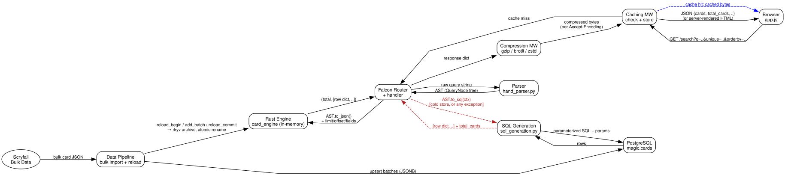

Every search on Sylvan Librarian can be answered by a Rust engine that's 76x faster than the database it was built to replace.
Every search can *also* still be answered without it — because the SQL path never left, and the only thing standing between the two is one `except Exception` in [api_resource.py](https://github.com/jbylund/sylvan_librarian/blob/da16942046241e77b4867e64bca49f87868fb7e3/api/api_resource.py#L1311-L1324):

```python
# trimmed of unrelated kwargs and caching — structure is unchanged
try:
    result = self._search_engine(parsed_query=parsed_query, ...)
except Exception as e:
    logger.warning("Engine query failed for %r, falling back to SQL: %s", query, e, exc_info=True)
else:
    ...
    return result

result = self._search_sql(parsed_query=parsed_query, ...)
```

Not `except _QueryError`. `except Exception`.
Any failure in the fast path — a bug in a brand-new plan, an unhandled AST node, a panic caught at the FFI boundary — falls through to the slow path silently, logs a warning, and the user never sees an error.
That single line is the load-bearing joint of the whole system, and understanding why it's shaped that way means walking through all six layers a query crosses to get an answer.

## The Whole Shape



The solid path is the common case on a cache miss: browser to cache check, into the router, out to the parser and back, out to the engine and back, through compression and into the cache store, back to the browser.
The dashed blue edge is the shortcut that skips almost all of it — a cache hit returns straight from the caching middleware without the router, the parser, the engine, or Postgres ever seeing the request.
The dashed red path is the fallback, and it's a complete second implementation of "answer a search query," not a degraded mode.
Two of these boxes (Engine and SQL) do the exact same job through entirely different mechanisms; two more (Caching and Compression) exist purely so that most repeat requests never reach either one.

## The Browser Renders Twice, Before and After JavaScript

The frontend is plain JS — no framework — and it does two things that look redundant until you notice neither one is optional: the first of several places in this system that pays for a second implementation on purpose.

First, it re-implements query-bracket balancing client-side.
[app.js](https://github.com/jbylund/sylvan_librarian/blob/da16942046241e77b4867e64bca49f87868fb7e3/api/static/app.js#L479-L554) has a `balanceSuffix`/`validateQuery` pair whose comment says outright that it exists to mirror `balance_partial_query` in `api/parsing/parsing_f.py` — a second, hand-maintained copy of parser logic, in a different language, whose only job is to auto-close a paren before the request even leaves the browser.
It's a parity risk the codebase accepts on purpose, because round-tripping to the server just to tell the user they forgot a `)` is worse UX than a client-side guess that's occasionally wrong.

Second, and more subtly: the server always renders full result HTML into the page, for every request, JS or not (`api/noscript_helpers.py`).
When the JS bundle loads, `displayResults` checks whether `#results` already has children and skips re-rendering if so ([app.js:703](https://github.com/jbylund/sylvan_librarian/blob/da16942046241e77b4867e64bca49f87868fb7e3/api/static/app.js#L703)).
There's no user-agent sniffing, no "are you a bot" branch.
The no-JS fallback and the JS-client's first-paint optimization are the same code path, because building them as one thing was cheaper than building "detect JS support" and building the fallback separately — and it means the no-JS path can never silently rot, since every browser exercises it on every request.

## One Process Model, Two Caches That Don't Know About Each Other

Falcon runs behind Bjoern, forked into a handful of worker processes ([api_worker.py](https://github.com/jbylund/sylvan_librarian/blob/da16942046241e77b4867e64bca49f87868fb7e3/api/api_worker.py)), each with its own middleware stack: timing, query logging, response caching, compression, security headers, CORS.
The middleware order looks straightforward until you read the comment at `api_worker.py:126` explaining that Falcon runs `process_response` in *reverse* registration order — so `QueryLogMiddleware`, registered after `TimingMiddleware`, actually finishes first on the way out.
Compression runs before caching stores the response, which is why `Accept-Encoding` has to be part of the cache key: a cached body is already gzipped or brotli'd for one specific client capability, and serving it to a client that didn't ask for that encoding would just break the response.

The two caches worth naming are the HTTP response cache (keyed on URI + params + `Accept-Encoding` + `Host`) and the Rust engine's in-memory card store.
They are invalidated by different triggers, and that gap is one of the few places in this system where the discrepancy is not fully closed — more on that below.
A cache hit is the dashed blue edge in the diagram above: it returns from the caching middleware directly, and the router, the parser, the engine, and Postgres never learn the request happened.

## A Query String Becomes an AST, Twice, in Two Parsers

`parse_scryfall_query` ([parsing_f.py:50](https://github.com/jbylund/sylvan_librarian/blob/da16942046241e77b4867e64bca49f87868fb7e3/api/parsing/parsing_f.py#L50)) is the seam every caller goes through: parse, then run a small rewrite pass over the resulting AST.
In production, parsing is done by `hand_parser.py`, a hand-written recursive-descent parser that replaced the original `pyparsing_based.py` grammar for a ~49x throughput gain (158k parses/sec vs. 3.2k).
`pyparsing_based.py` is still in the repository — not dead code, but the other half of a parity test suite ([test_parser_parity.py](https://github.com/jbylund/sylvan_librarian/blob/da16942046241e77b4867e64bca49f87868fb7e3/api/parsing/tests/test_parser_parity.py)) that runs both parsers' output through `generate_sql_query` and asserts identical SQL, or identical failures, for the same input — checking the parsers agree on what a query means, not that they build the same tree to mean it, so a change to the fast parser can't silently diverge from the reference grammar it replaced.

Every node in the resulting tree implements three methods: `to_sql`, `to_human_explanation`, and `to_json`.
The first two are unsurprising.
The third is the one that matters for the rest of this post, because it's the entire contract between the Python parser and the Rust engine — there is no shared type, no shared memory, just a JSON tree crossing a language boundary.

## The AST Crosses the FFI Boundary as JSON, Not as Objects

`card_engine` is a PyO3 extension that receives that JSON tree, decodes it into its own Rust `FilterExpr` enum, and evaluates it against an entire card corpus held in a single shared-memory region.
Every worker process mmaps the same read-only [rkyv](https://github.com/rkyv/rkyv) archive at `/dev/shm/sylvan_librarian_cards` — zero deserialization on the read path, because rkyv lets Rust access the archived struct directly through the mapped bytes.

Two mechanisms in this layer are worth pulling out on their own:

**Bitplane algebra for low-cardinality fields.**
Colors, types, legality, rarity, and a handful of other fields get peeled out of the filter tree into ~4 KB bitplanes — one bitset per (dimension, value) — and evaluated as word-wise AND/OR/NOT instead of a per-card filter dispatch.
That's the difference between 31,500 individual filter calls and a few hundred word operations for the same query, a mechanism covered in more depth in [Transposed Bitplanes](../01088_transposed-bitplanes/index.md).

**Cost-based plan selection.**
`query()` doesn't run one fixed algorithm.
It computes cheap exact features about the parsed query and takes an `argmin` over six candidate physical plans using cost formulas fitted against the real corpus — a genuine, if miniature, query optimizer living entirely in Rust, described in [We Replaced Our Query Planner's Decision Tree with a Cost Model](../01120_cost-based-plan-routing/index.md).

The [benchmark behind this post's title](https://github.com/jbylund/sylvan_librarian/blob/da16942046241e77b4867e64bca49f87868fb7e3/docs/prs/rust-filter-extension.md) ran 11 queries against a local dev deployment with 96,139 cards loaded (`unique=card`, `limit=100`; engine timed over a 20-warmup, 3-second window, SQL over 15 runs with the first 3 discarded and the query cache cleared each call): a 0.20 ms geometric mean for the engine against 14.9 ms for SQL, 76.5x overall, ranging query-by-query from 20x (`power+toughness>8`) to 190x (`t:merfolk and name:tide`).

## The Same AST Also Knows How to Become SQL

`sql_generation.py` calls `to_sql` on the same AST the engine would have received as JSON, and gets back something more unusual than a return value: each leaf node mutates a shared `QueryContext` dict as a side effect, base64-encoding its literal value into the placeholder name itself (`p_str_<b64>`), so parameter binding falls out of the recursive walk instead of being threaded through every node's return type.

The assembled query is one round trip that answers two questions at once.
A CTE scans `magic.cards` against the generated `WHERE` clause once, then `UNION ALL`s a `LIMIT`-ed row branch with a `COUNT(1)` branch — page and total count in a single execution instead of two.
The `magic.cards` table backing it has 20-plus purpose-built indexes: trigram GIN for fuzzy text, JSONB GIN for array containment on colors and legalities, B-tree for numeric ranges, and a few covering indexes sized specifically for common `(cmc, edhrec_rank)`-shaped sorts.

This is the path that runs when the engine's store is cold at startup, when `ENABLE_ENGINE` is off, or — the interesting case — whenever `_search_engine` raises anything at all.
It's slower by design in the sense that nobody optimized it away: it's a complete, independently correct implementation kept at full fidelity specifically so it can catch whatever the fast path doesn't handle yet.

**The obvious objection:** if the engine is 76x faster, why not fix bugs forward and delete the SQL path?
Three reasons, roughly in ascending order of how hard they'd be to give up.
"76x faster on a representative query mix" is a statement about the queries someone thought to benchmark, and the parity suite that keeps the two parsers honest has no equivalent for the two query engines — SQL against the real relational data is still the closest thing this system has to a ground truth to be wrong against.
Postgres is also just a nicer place to ask a question nobody thought to expose through the API: `EXPLAIN ANALYZE` and a real SQL client beat writing a one-off Rust query against an opaque in-memory struct every time someone wants to check something ad hoc.
And least replaceable: Postgres isn't only queried, it's where some of what gets queried is *computed*.
`prefer_score` — the per-printing weight that decides whether a `unique=card` search surfaces the black-border original over the showcase foil — comes from [a single `UPDATE ... FROM` over a CTE of `CASE` expressions and a correlated illustration-popularity subquery](https://github.com/jbylund/sylvan_librarian/blob/da16942046241e77b4867e64bca49f87868fb7e3/api/sql/backfill_prefer_scores.sql), run entirely in SQL against `raw_card_blob` and neighboring rows.
The Rust engine never computes that number.
It only ever reads the column Postgres already filled in.

## Data Flows to Two Places That Have to Agree, on Different Schedules

Card data begins as Scryfall's bulk data dump, fetched and cached to disk, then streamed card-by-card into a Postgres upsert (`ON CONFLICT ... WHERE IS DISTINCT FROM`, skipping no-op writes) in batches of 6,000.
A successful import then drives a staged reload of the Rust store — `reload_begin` / `add_batch` (2,000 rows at a time via a server-side cursor) / `reload_commit` — which serializes a fresh rkyv archive to a per-process temp file and, only at the very end, atomically renames it into place.
Every other worker detects the new archive by `stat`-ing for an inode change; queries in flight against the old mmap keep working, because the old file's inode is still valid until nothing references it.
A cross-process `flock` ensures only one worker ever pays the rebuild cost; if two workers race, the loser sees the winner's new inode mid-build and just picks it up instead of redoing the work.

Here's the honest gap: bulk import invalidates the engine's card store and the internal query-result cache together, but it does *not* reach into the HTTP response cache sitting in front of everything.
The cache (`LRUCache(maxsize=10_000)`, no TTL) has no time-based expiry at all — an entry only leaves by being evicted to make room for a newer one, so on a quiet query shape there's no bound on how long a stale response can keep answering requests after Postgres and the Rust engine have both already moved past it.
Named because it's true, not because it's been fixed.

## What "Big Layers" Actually Means Here

The interesting thing about drawing this system as boxes and arrows isn't the boxes — it's that two of them (Engine, SQL) implement the same function, disagree about how, and are wired together by an exception handler that trusts the older one more.
That is not the accidental result of technical debt.
It is the only way to ship a 76x speedup without ever being sure, on day one, that it's right about everything.
